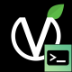

#  Vincent OS Shell
This is a derivative of the Terminal program in the Vincent OS App mini operating system.
 
# ⚠ This project has been abandonned due to a change of plan in Vincent OS.
Vincent OS should have its own shell, however, due to complexity of development.

Vincent OS will not have its own shell. It will be replaced by:
- PowerShell for Vincent OS
- Bash for Vincent OS Legacy

If you are interested to retake this project, you can fork this repository.
 
## Installation
You can get the separate installer via the releases page.

### Installation développeur
First all, clone the repo.

#### With Visual Studio 2022 Community
1. Open the project : Vincent.OS.Shell.sln
2. Build the project

#### With ``dotnet``
1. Access to the folder "src/Vincent.OS.Shell" with your terminal.
2. Enter the following command :
```
$ dotnet build 'Vincent.OS.Shell.csproj'
```
3. Access to the folder "bin" and all it's subfolders and launch with :
```
$ dotnet 'Vincent.OS.Shell.dll'
```

## Information
This project is open source with the following license: GPL-3.
